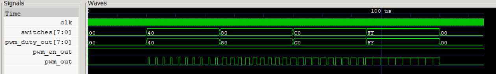

# Test Report

## Motor Profile Verification

This project implements Option B: switch-controlled duty. In this profile, the PWM duty cycle is controlled by the external 8-bit `switches` input. The testbench drives `switches` through several different values, including `8'h00`, `8'h40`, `8'h80`, `8'hC0`, `8'hFF`, and then back to `8'h00`. This allows the simulation to verify that the PWM output changes according to the switch input.

The CPU program uses memory-mapped I/O to control the PWM hardware. It repeatedly reads the switch value from MMIO address `0x0090` and writes that value to the PWM duty register at MMIO address `0x0098`. The PWM enable register is located at address `0x009C`, and the program writes `1` to this address near the beginning of execution to enable the PWM controller.

The assembly program creates the switch-controlled pattern by continuously polling the switch MMIO address. After enabling PWM, the program enters an infinite loop. In each loop iteration, it performs a load from `0x0090` to read the current switch value, then performs a store to `0x0098` to update the PWM duty register. Therefore, when the testbench changes the switch input, the new value is copied into the PWM duty register on a later loop iteration. The PWM controller then converts that duty value into the corresponding output pulse width.

The intended software behavior can be summarized as follows:

```text
enable PWM

loop:
    read switches from 0x0090
    write switch value to PWM duty register at 0x0098
    repeat loop
```

This verifies that the CPU, MMIO decoder, software program, and PWM peripheral are working together as one integrated system.

## Expected Results

After reset, the CPU begins executing the program loaded from `memfile.dat`. Shortly after the program starts, the PWM enable register should change to `1` because the software writes `1` to address `0x009C`. Once PWM is enabled, the duty register should follow the switch input as the CPU repeatedly executes the polling loop.

When `switches = 8'h00`, the duty value is zero, so `pwm_out` should remain low. When `switches = 8'h40`, the duty value is 64, so the waveform should have a relatively small high-time ratio, approximately 25%. When `switches = 8'h80`, the duty value is 128, so the waveform should be approximately half high and half low. When `switches = 8'hC0`, the duty value is 192, so the high portion of the waveform should become wider, approximately 75%. When `switches = 8'hFF`, the duty value is 255, so the output should be high for almost the entire PWM period.

This satisfies the Option B verification requirement because the waveform shows the PWM duty cycle changing for more than three different switch values.

The testbench dumps `wave.vcd` for waveform inspection. The important signals included in the waveform are:

```text
pwm_out
switches
pwm_duty_out
pwm_en_out
pc_out
mem_write_M
alu_result_M_reg
write_data_M
```

The `switches` signal shows the external input values driven by the testbench. The `pwm_duty_out` signal shows the current PWM duty register value. The `pwm_en_out` signal confirms whether PWM is enabled. The `pwm_out` signal shows the actual PWM waveform generated by the controller. The CPU-related signals such as `pc_out`, `mem_write_M`, `alu_result_M_reg`, and `write_data_M` help confirm that the CPU is executing memory operations to the correct MMIO addresses.

## Waveform Verification

The waveform profile below was generated from `wave.vcd` and shows the PWM output changing as the switch input changes.



The GTKWave screenshot below shows the same Option B behavior with the assignment-friendly signal names `switches[7:0]`, `pwm_duty_out[7:0]`, `pwm_en_out`, and `pwm_out`.


The waveform should be interpreted as follows. When the switch input is `8'h00`, the PWM duty register becomes zero and `pwm_out` remains low. When the switch input changes to `8'h40`, the PWM output begins producing a narrow pulse. When the switch input changes to `8'h80`, the pulse width increases to approximately half of the PWM period. When the switch input changes to `8'hC0`, the high portion becomes wider. When the switch input becomes `8'hFF`, the output is high for nearly the entire PWM period. Finally, when the switch input returns to `8'h00`, the PWM output returns to low.

This waveform behavior confirms that the switch input is correctly read by the CPU through MMIO, copied into the PWM duty register by software, and converted into a PWM waveform by the hardware controller.

## Edge Cases Tested

| Case | Expected behavior |
| --- | --- |
| `enable = 0` | `pwm_out` remains low regardless of the duty value |
| `duty = 0` | `pwm_out` remains low because `counter < duty` is never true |
| `duty = 255` | `pwm_out` is high for 255 counts and low for one count per 256-count PWM period |
| switches change faster than the loop reads | The duty register updates only when the next `lw`/`sw` loop observes and writes the new value |

The first edge case confirms that the enable signal has priority over the duty value. Even if the duty register contains a nonzero value, the PWM output should remain low when the enable register is zero.

The second edge case checks the minimum duty value. Since the PWM output is generated using the condition `counter < duty`, a duty value of zero means there is no counter value that satisfies the comparison. Therefore, the output remains low for the entire PWM period.

The third edge case checks the maximum 8-bit duty value. Because the comparator uses `counter < duty`, a duty value of 255 does not produce a perfect 100% duty cycle. Instead, the output is high when the counter is from 0 to 254 and low when the counter is 255. Therefore, the output is high for 255 out of 256 counts.

The fourth edge case is specific to the switch-controlled profile. If the switch input changes faster than the software loop can read it, the duty register will not update instantly at the exact moment the switch changes. Instead, the CPU updates the duty register only when the loop performs the next load from `0x0090` and store to `0x0098`. This behavior is expected because the CPU is polling the input rather than using an interrupt or direct hardware connection.

## Conclusion

The simulation confirms that the implemented system works as intended. The CPU executes the program from `memfile.dat`, enables the PWM controller through MMIO, repeatedly reads the switch input, and writes the switch value to the PWM duty register. The PWM controller then generates an output waveform whose pulse width changes according to the duty register value.

The observed behavior matches the expected Option B motor profile. Different switch values produce different PWM duty cycles, and the tested edge cases show that the enable signal, minimum duty value, maximum duty value, and polling behavior operate correctly.
